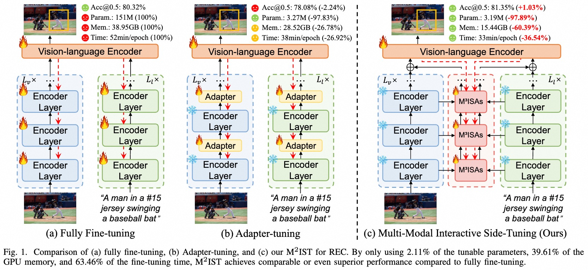

<div align=center>

<h1> M<sup>2</sup>IST: Multi-Modal Interactive Side-Tuning for Efficient Referring Expression Comprehension </h1>


<h4 align="center"> 

[Xuyang Liu](https://xuyang-liu16.github.io/)<sup>1*</sup>,
[Ting Liu](https://github.com/liuting20)<sup>2*</sup>,
[Siteng Huang](https://kyonhuang.top/)<sup>3✉</sup>,
[Yi Xin](https://synbol.github.io/)<sup>4</sup>,
Yue Hu<sup>2</sup>,
Long Qin<sup>2</sup>,
[Donglin Wang](https://milab.westlake.edu.cn/)<sup>3</sup>,
[Honggang Chen](https://sites.google.com/view/honggangchen/)<sup>1✉</sup>

<sup>1</sup>Sichuan University, <sup>2</sup>National University of Defense Technology, <br>
<sup>3</sup>Westlake University, <sup>4</sup>Nanjing University

</h4>

</div>

## ✨ Overview
<p align="center">  </p>

> **TLDR:** We present M<sup>2</sup>IST, a novel parameter-efficient transfer learning method that achieves comparable or superior performance to full fine-tuning while using only **2.11%** of trainable parameters, **39.61%** of GPU memory, and **63.46%** of training time.

### :point_right: Getting Started

Please refer to [GETTING_STARGTED.md](GETTING_STARTED.md) to learn how to prepare the datasets and pretrained checkpoints.


### :point_right: Installation
1.  Clone this repository.
    ```
    git clone https://github.com/xuyang-liu16/M2IST.git
    ```

2.  Prepare for the running environment. 

    ```
    pip install -r requirements.txt
    ```

### :point_right: Training and Evaluation

1.  Training
    ```
    CUDA_VISIBLE_DEVICES=0 python -u train.py --batch_size 64 --lr_bert 0.00001 --aug_crop --aug_scale --aug_translate --backbone resnet50 --detr_model ./checkpoints/detr-r50-referit.pth --bert_enc_num 12 --detr_enc_num 6 --dataset unc --max_query_len 20 --output_dir outputs/referit_r50 --epochs 90 --lr_drop 60
    ```

    We recommend to set --max_query_len 40 for RefCOCOg, and --max_query_len 20 for other datasets. 
    
    We recommend to set --epochs 180 (--lr_drop 120 acoordingly) for RefCOCO+, and --epochs 90 (--lr_drop 60 acoordingly) for other datasets. 

2.  Evaluation
    ```
    CUDA_VISIBLE_DEVICES=0 python -u eval.py --batch_size 64 --num_workers 4 --bert_enc_num 12 --detr_enc_num 6 --backbone resnet50 --dataset unc --max_query_len 20 --eval_set testA --eval_model ./outputs/referit_r50/best_checkpoint.pth --output_dir ./outputs/referit_r50
    ```

### :thumbsup: Acknowledge
We extend our gratitude to the open-source efforts of [TransVG](https://github.com/djiajunustc/TransVG) and [DARA](https://github.com/liuting20/DARA).


## :pushpin: Citation
Please consider citing our paper in your publications, if our findings help your research.
```bibtex
@article{Liu2024:M2IST,
      title={M$^2$IST: Multi-Modal Interactive Side-Tuning for Efficient Referring Expression Comprehension}, 
      author={Xuyang Liu and Ting Liu and Siteng Huang and Yi Xin and Yue Hu and Quanjun Yin and Donglin Wang and Honggang Chen},
      year={2024},
      eprint={2407.01131},
      archivePrefix={arXiv},
      primaryClass={cs.CV}
}
```

## 📩 Contact
For any question about our paper or code, please email `liuxuyang@stu.scu.edu.cn`.
